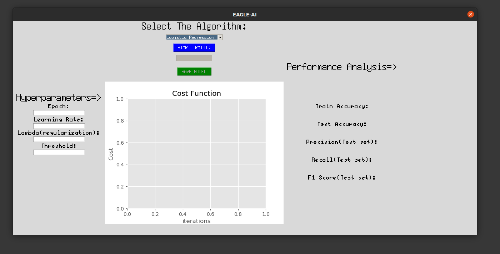
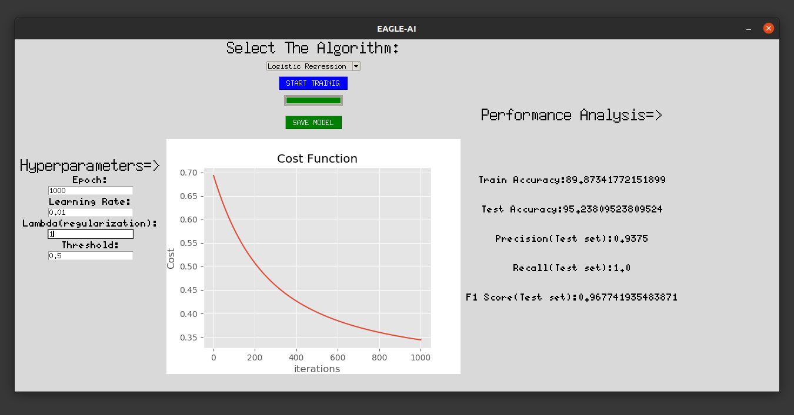

<h1 align="center">
  Eagle-AI-GUI
</h1>
 <h3 align="center">
  GUI for Machine-Learning Algorithms
</h3>
 

 

  
  

 
  
## Installation
  **Step-1:** Download and extract the files
  
  **Step-2:** <a href='https://uoa-eresearch.github.io/eresearch-cookbook/recipe/2014/11/26/python-virtual-env/'>Create a virtual enviroment</a>(optional)
  
  **Step-3:** open the path where files are extracted in terminal
  
  **Step-4:** type *pip install -r requirements.txt* and hit enter in terminal
  
  **Step-5:** type *python main.py* and hit enter to start the application
## Usage Guide
* **Linear Regression**

  **Sample file is in samples/Linear Regression directory**
  
  
  **Step-1:** This is first screen that will appear when the program is executed, load in your Training set, DEV set and Test set and press initialize.
  
    
  
    **Note->**
    * **You must load in only .csv, .xls or .xlsx file** 
    * **Columns of the file uploaded will be used as parameters(features)**
    * **Column of one is added by the application and it should not be present in original file**
    * **It is considered a good practice to have different test and Dev(cross validation) set but same file can be uploaded in both**
    * **Normalization is applied automatically by the application**

    
    
  **Step-2:** After Initialization this screen will appear, from the dropdown list choose "Linear Regression" fill in the *hyper parameters* than
    press *START TRAINING*.
    
    

    **Progress Bar below "START TRAINING" button denotes the progress in model training.**
    
    **Step-3:** After the training is finished a pop-up message will appear stating the successfull completion of model training. 
    
    To save the model press *SAVE MODEL* this will export three files one containing parameters and other two containing normalization factors
    
    
 
* **Logistic Regression**
 
  **Sample file is in samples/Logistic Regression directory**
  
  **Step-1:** *Same as in Linear Regression*
  
  **Note->**
    * **You must load in only .csv, .xls or .xlsx file** 
    * **Columns of the file uploaded will be used as parameters(features)**
    * **Column of one is added by the application and it should not be present in original file**
    * **It is considered a good practice to have different test and Dev(cross validation) set but same file can be uploaded in both**
    * **Normalization is applied automatically by the application**
    * **Multi-Class classification is not supported(currently) so y column should have only zeros or one**
    
  **Step-2:** After Initialization this screen will appear, from the dropdown list choose "Logistic Regression" fill in the *hyper parameters* than
    press *START TRAINING*.
    
    
    
   **Step-3:** After the training is finished a pop-up message will appear stating the successfull completion of model training. 
    
    To save the model press *SAVE MODEL* this will export three files one containing parameters and other two containing normalization factors
    
    
