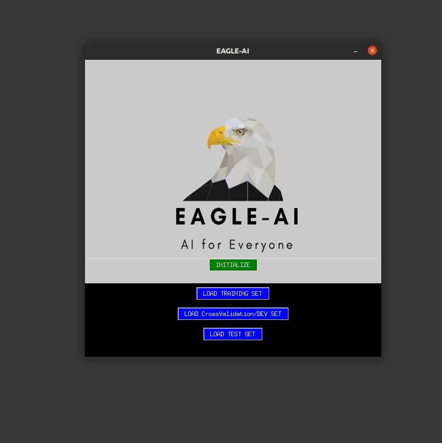
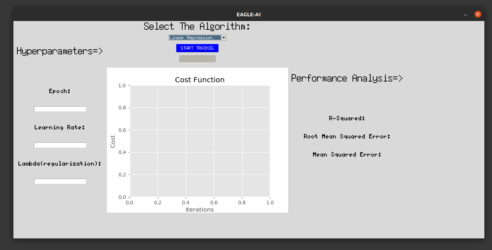
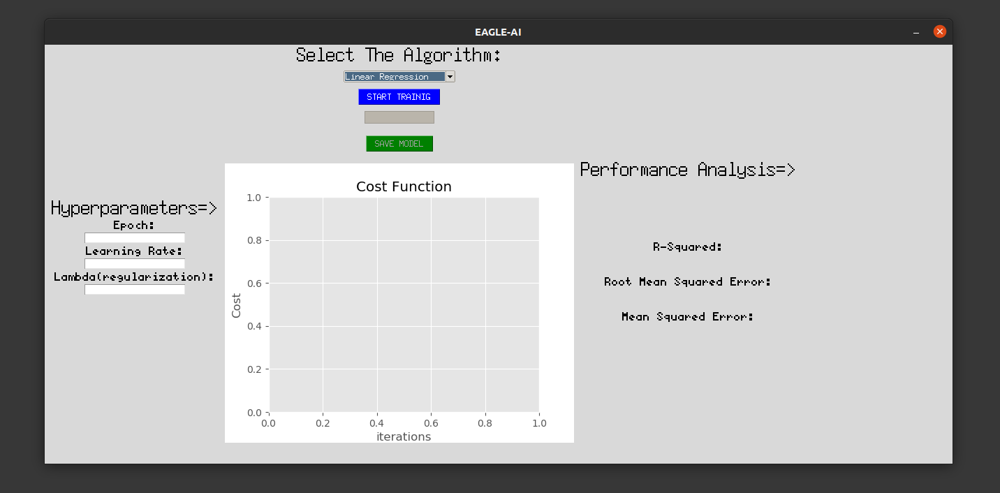

<h1 align="center">
  Eagle-AI-GUI
</h1>
 <h3 align="center">
  GUI for Machine-Learning Algorithms
</h3>
 

 

  
  

 
  
## Installation
  ...
## Usage Guide
* Linear Regression

  
  
  This is first screen that will appear when the program is executed, load in your Training set, DEV set and Test set and press initialize.
  
  **Note->**
  * **You must load in only .csv, .xls or .xlsx file** 
  * **Columns of the file uploaded will be used as parameters(features)**
  * **Column of one is added automatically by the application and it should not be present in original file**
  * **It is considered a good practice to have different test and Dev(cross validation) set but same file can be uploaded in both**
  
    
    
    After Initialization this screen will appear, from the dropdown list choose "Linear Regression" fill in the hyper parameters than
    press "START TRAINING".
    
    **Progress Bar below "START TRAINING" button denotes the progress in model training.**
    
    After the training is finished a pop-up message will appear stating the successfull completion of model training. 
    
    Image below shows the state after model training is finished successfully
    
    
  
